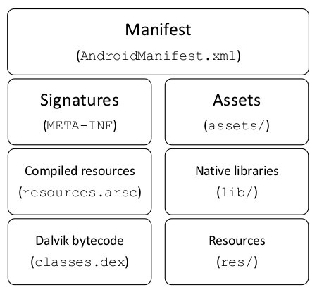
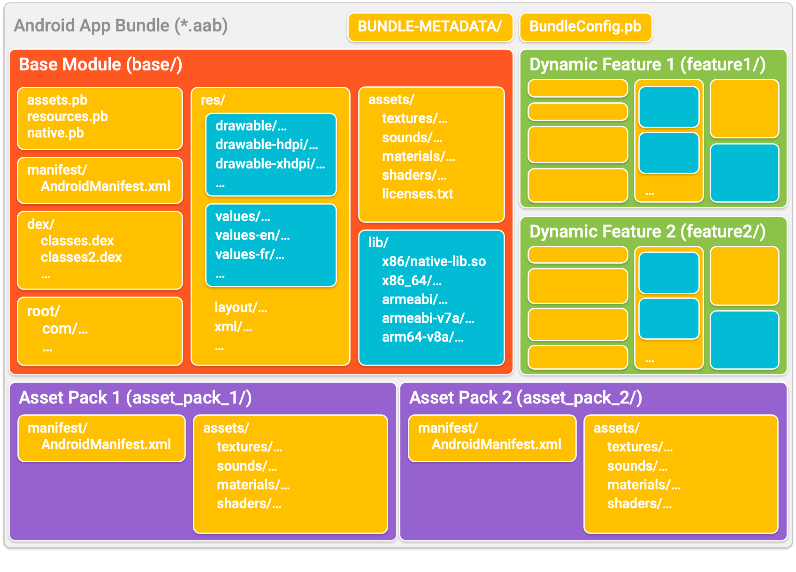
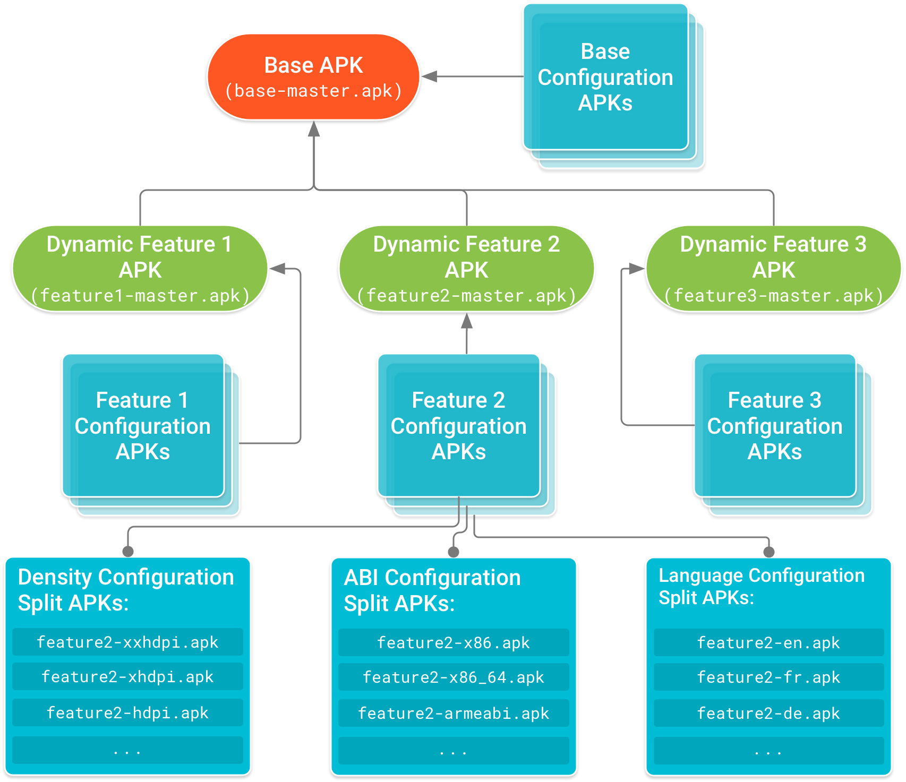

# Android package

Android apps are distributed in APK (Android package) archives. The APK file is a ZIP-compressed archive that contains all the contents of an Android app and is the file that Android-powered devices use to install the app.

The APK file has the following structure:

| Name | Type | Description |
|: --- |: --- :|: --- |
| META-INF | Directory | This directory contains APK metadata. |
| META-INF/MANIFEST.MF | File | This file contains various information used by the Java run-time environment when loading the JAR file, such as which is the main class to be run, version of a package, build number, creator of the package, security policies/permissions of Java applets and Java webstart packages, the list of file names in the JAR along with their SHA-256 digests, etc. |
| META-INF/CERT.RSA or META-INF/CERT.DSA | File | Contains signed content of `CERT.RF` and is used to verify app integrity with the public key. |
| META-INF/CERT.SF | File | This file contains the list of all files along with their SHA-1 digest. |
| lib | Directory | This directory contains the compiled code that is platform dependent. |
| lib/armeabi-v7a | Directory | This directory contains compiled code for all ARMv7 and above based processors only. |
| lib/arm64-v8a | Directory | This directory contains compiled code for all ARMv8 arm64 and above based processors only. |
| lib/x86 | Directory | This directory contains compiled code for x86 processors only. |
| lib/x86_64 | Directory | This directory contains compiled code for x86_64 processors only. |
| kotlin | Directory | It contains Kotlin specific data (only if the application is written in Kotlin). |
| res | Directory | This directory contains resources not compiled into `resources.arsc`. |
| assets | Directory | This directory contains application assets. |
| AndroidManifest.xml | File | This file is the manifest of the Android application. It contains information about - package name, application components application's permissions, compatibility features, etc. |
| classes.dex | File | This file is the classes compiled in the `dex` file format understandable by the Dalvik virtual machine and by the Android Runtime. |
| resources.arsc | File | This file contains precompiled resources, such as strings, colors, or styles. |

# Android App Bundles

An Android App Bundle is a publishing format that includes all an application's compiled code and resources, and defers APK generation and signing to Google Play.

Google Play uses an app bundle to generate and serve optimized APKs for each device configuration, so only the code and resources that are needed for a specific device are downloaded to run the application.


In the second half of 2021, new apps will be required to publish with the Android App Bundle on Google Play.


An Android App Bundle is a file (with the `.aab` file extension) that developers upload to Google Play.

App bundles are signed binaries that organize an application's code and resources into modules. Code and resources for each module are organized similarly to what you would find in an APK — and that makes sense because each of these modules may be generated as separate APKs. Google Play then uses the app bundle to generate the various APKs that are served to users, such as the base APK, feature APKs, configuration APKs, and (for devices that do not support split APKs) multi-APKs. The directories that are colored in blue — such as the `drawable/`, `values/`, and `lib/` directories — represent code and resources that Google Play uses to create configuration APKs for each module.

The following list describes some of the app bundle's files and directories in more detail:
- **base/, feature1/ and feature2/** - each of these top-level directories represent a different module of an application. The base module for the application is always contained in a `base` directory of the app bundle. However, the directory for each feature module is given the name specified by the `split` attribute in the module's manifest, see [docs](https://developer.android.com/guide/app-bundle/play-feature-delivery#feature-module-manifest)).
- **asset_pack_1/ and asset_pack_2/** - for large, graphically-demanding apps or games, developers can modularize assets into asset packs.
- **BUNDLE-METADATA/** - this directory includes metadata files that contain information useful for tools or app stores (for example, ProGuard mappings or the complete list of the app's DEX files). Files in this directory are not packaged into the app's APKs.
- **Module Protocol Buffer (*.pb) files** - these files provide metadata that helps describe the contents of each app module to app stores, such as Google Play.
- **manifest/** - unlike APKs, app bundles store the AndroidManifest.xml file of each module in this separate directory.
- **dex/** - unlike APKs, app bundles store the DEX files for each module in this separate directory.
- **res/, lib/, and assets/** - these directories are identical to those in a typical APK.
- **root/** - this directory stores files that are later relocated to the root of any APK that includes the module that this directory is located in.

## Overview of split APKs

A fundamental component of serving optimized applications is the split APK mechanism available on Android 5.0 (API level 21) and higher. Split APKs are very similar to regular APKs—they include compiled DEX bytecode, resources, and an Android manifest. However, the Android platform is able to treat multiple installed split APKs as a single app. That is, you can install multiple split APKs that have access to common code and resources, and appear as one installed app on the device.

The following describes the different types of APKs that may be installed together on a device to form a full application experience.
- **Base APK** contains code and resources that all other split APKs can access and provides the basic functionality for an application. When a user requests to download the application, this APK is downloaded and installed first. That's because only the base APK's manifest contains a full declaration of the application's services, content providers, permissions, platform version requirements, and dependencies on system features. Google Play generates the base APK for the application from the project's application (or base) module.
- **Configuration APKs** includes native libraries and resources for a specific screen density, CPU architecture, or language. When a user downloads an application, their device downloads and installs only the configuration APKs that target their device. Each configuration APK is a dependency of either a base APK or feature module APK. If developers use standard practices to [organize alternative, configuration-specific resources](https://developer.android.com/guide/topics/resources/providing-resources#AlternativeResources) for their base and feature modules, Google Play automatically generates configuration APKs for them.
- **Feature module APKs** contain code and resources for a feature of an application that developers modularize using feature modules. Developers can then customize how and when that feature is downloaded onto a device. Google Play generates feature module APKs for the application from the project's feature modules.

Consider an app with three feature modules and support for multiple device configurations. Figure below illustrates what the dependency tree for the app's various APKs may look like. Note that the base APK forms the head of the tree, and all other APKs depend on the base APK.

# References

- [APK files under the hood](https://www.appdome.com/no-code-mobile-integration-knowledge-base/apk-files-under-the-hood/)
- [Android Developers: About Android App Bundles](https://developer.android.com/guide/app-bundle)
