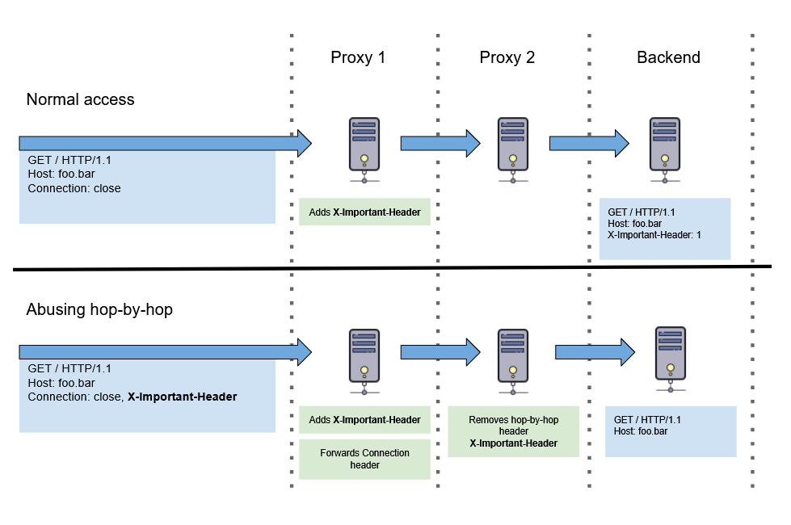

This section covers techniques which can be used to influence web systems and applications in unexpected ways, by abusing HTTP/1.1 hop-by-hop headers. Systems affected by these techniques are likely to have multiple caches / proxies that process requests before reaching the server application.

# Hop-by-Hop Request Header

The specification [RFC 2612](https://tools.ietf.org/html/rfc2616#section-13.5.1) defines two categories of HTTP headers:
- End-to-end headers, which are transmitted to the ultimate recipient of a request or response. End-to-end headers in responses **must** be stored as part of a cache entry and **must** be transmitted in any response formed from a cache entry.
- Hop-by-hop headers, which are meaningful only for a single transport-level connection, and are not stored by caches or forwarded by proxies.

In other words, a hop-by-hop header designed for processing and using by the proxy server that is currently processing the request, unlike the end-to-end header, which is designed to be present in the request until the end of the request.

The specification [RFC 2612](https://tools.ietf.org/html/rfc2616#section-13.5.1) defines the following headers as hop-by-hop by default:
- `Keep-Alive`,
- `Transfer-Encoding`,
- `TE`,
- `Connection`,
- `Trailer`,
- `Upgrade`,
- `Proxy-Authorization`,
- `Proxy-Authenticate`.

All other headers defined by HTTP/1.1 are end-to-end headers.

If hop-by-hop headers are found in the request, a compatible proxy server should process or perform actions regardless of what these headers indicate, and not forward them to the next hop.

A request [may also define a custom set of headers to be treated as hop-by-hop](https://tools.ietf.org/html/rfc2616#section-14.10) by adding them to the `Connection` header, like this:
```http
Connection: close, X-Foo, X-Bar
```
The client asks the proxy server to treat `X-Foo` and` X-Bar` as hop-by-hop, which means that the client wants the proxy to remove them from the request before sending the request.

# Abusing HTTP hop-by-hop Request Headers

The `Connection` header itself is the default hop-by-hop header. This implies that a compatible proxy server should not forward a list of custom hop-by-hop headers to the next server in the chain in its `Connection` header when it forwards the request. However, in practice this does not always occur, some systems either forward the entire `Connection` header or copy the hop-by-hop list and add it to their own `Connection` header. For example, most likely HAProxy pass the `Connection` header untouched, the same behavior with Nginx in reverse proxy mode.

The following image shows how abusing hop-by-hop headers may cause problems if the backend expects a `X-Important-Header` and considers its presence in the logical decision.



A quick and easy way to verify that systems are vulnerable to some sort of abuse hop-by-hop request header is to use a `Cookie` header for an endpoint which requires authentication (assuming the target system uses cookie authentication). For example, if `/api/users/profile` endpoint returns `200 OK` with information about the user profile, the request:
```http
GET /api/users/profile HTTP/1.1
Host: vulnerable-website.com
Cookie: sessionid=...
Connection: close, Cookie
```
may return something other than the expected response if the system is vulnerable to abusing HTTP hop-by-hop request headers. To search for more interesting effects, you can use Burp Suite Intruder or a custom script with a list of known headers, like [this one](https://github.com/danielmiessler/SecLists/blob/master/Discovery/Web-Content/BurpSuite-ParamMiner/lowercase-headers).

## Masking the Source IP Address

When an frontend proxy server accepts a user's request, it can add the IP address of that user to the `X-Forwarded-For` header so that the infrastructure and applications in the backend can know the user's source IP address. However, if we instruct proxies that `X-Forwarded-For` header is hop-by-hop, it will be removed from the request, and the backend application will either never receive it, or receive the IP address of the sever in elsewhere in the chain.

In addition to masking the source IP address from some components of the system infrastructure, this method may offer a way to bypass authentication or access control decisions. For example, if a request is detected that originates from a local range of IP addresses, the application processes the request as trusted and provides access to internal resources.


Do not forget that `X-Forwarded-For` header is not the only header for transmitting the user's real IP address, `Forwarded`, `X-Real-IP` and many others are also used.


## Fingerprinting services

When searching for hop-by-hop headers, you should pay attention to the differences in the responses that the server sends. Removing technology-specific or stack-specific HTTP headers can cause various side effects that allow you to collect more information about the system. The more specific the header, the more accurate the system's fingerprint.

## Cache Poisoning DoS

The impact in this case is very similar to achieved with the usual [Cache Poisoning DoS](https://cpdos.org). However in this case the method is slightly different - instead of directly using or modifying request headers which create unwanted application state and poison a web cache, we use hop-by-hop headers to create this unwanted the application's state and remove the headers on which the application relies in order to function normally.

To exploit this, it is necessary that:

1. A frontend cache should forward a custom set of hop-by-hop headers, instead of process these.
2. Any intermediate proxy in the chain should process the custom set and remove the headers.
3. The application should consider the presence of these headers and, if they are absent, return an unwanted response, for example, `400 Bad Request` or `501 Not Implemented`.

As a result, this can lead to the fact that the web cache before the application caches this unwanted response and uses it to serve other users, and therefore we have a cache poisoning denial of service.

# References

- [Abusing HTTP hop-by-hop request headers](https://nathandavison.com/blog/abusing-http-hop-by-hop-request-headers)